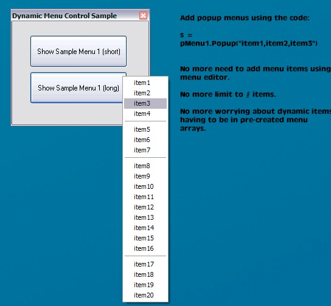



## Dynamic Popup Menu Control

### Description

This is a usercontrol written in vb6 that enables you to create your own dynamic popup menus.

For example, instead of creating hidden menu's in the menu editor, giving each one a name, or, creating an array of holders for dynamic entries, you can simply do this:

UserChoice = popMenu.Popup("item1,item2,item3")

A seemingly simply thing, but has been quite useful for my projects, so I thought I would pass it on. It started off as a class, but I turned it into a user control so it would be easier to use for beginners.

Hope you find it useful -
 
### More Info
 

             |
---                |---
**Submitted On**   |2006-08-11 20:40:46
**By**             |[Anthony Awx](https://github.com/Planet-Source-Code/PSCIndex/blob/master/ByAuthor/anthony-awx.md)
**Level**          |Intermediate
**User Rating**    |5.0 (45 globes from 9 users)
**Compatibility**  |VB 6\.0
**Category**       |[Custom Controls/ Forms/  Menus](https://github.com/Planet-Source-Code/PSCIndex/blob/master/ByCategory/custom-controls-forms-menus__1-4.md)
**World**          |[Visual Basic](https://github.com/Planet-Source-Code/PSCIndex/blob/master/ByWorld/visual-basic.md)
**Archive File**   |[Dynamic\_Po2012828112006\.zip](https://github.com/Planet-Source-Code/anthony-awx-dynamic-popup-menu-control__1-66255/archive/master.zip)

